# gh-social-ml — Project Codex

> **What is this?** The ML / recommendation backend for **gh-social**, a GitHub-based social platform. It discovers, ingests, embeds, ranks, and serves a personalised "For You" feed of GitHub repositories to users.

---

## High-Level Architecture

```mermaid
flowchart LR
    subgraph Acquisition
        A1["GitHub GraphQL Discovery"] --> A2["Repository Enricher"]
        A2 --> A3["Quality Filter"]
    end

    subgraph Ingestion
        A3 --> B1["Feature Extraction"]
        B1 --> B2["Novelty / Dedup Gate"]
        B2 --> B3["Classification"]
    end

    subgraph Embedding
        B3 --> C1["Sentence-Transformer Embedder"]
        C1 --> C2["Qdrant Vector Store"]
    end

    subgraph Trending
        T1["GitHub Trending Scraper"] --> T2["PostgreSQL Storage"]
    end

    subgraph Retrieval
        C2 --> D1["Semantic Channel (Qdrant)"]
        T2 --> D2["Trending Channel (Postgres)"]
        D1 --> D3["CandidateRetriever — merge & dedupe"]
        D2 --> D3
    end

    subgraph Ranking
        D3 --> E1["Feature Builder + Scaler"]
        E1 --> E2["MMoE Heavy Ranker (PyTorch)"]
        E2 --> E3["Batch Caching (Postgres)"]
    end

    subgraph Serving
        E3 --> F1["FastAPI: /api/internal/ml/assemble-feed"]
        F1 --> F2["Freshness Injection"]
        F2 --> F3["Exploration Shuffle"]
        F3 --> F4["Ordered repo IDs → Backend"]
    end

    subgraph Feedback Loop
        F4 -.->|click / like / save / dwell / skip| G1["Event Handlers"]
        G1 --> G2["User Embedding Shift (Qdrant)"]
        G1 --> G3["Engagement Counters (Postgres)"]
    end
```



---

## Pipeline Stages (in execution order)

### 1. Acquisition — [main.py](file:///Users/medhanshadhlakha/gh-social-ml/main.py) + [acquisition/](file:///Users/medhanshadhlakha/gh-social-ml/acquisition)

| File | Role |
|------|------|
| [graphql_queries.py](file:///Users/medhanshadhlakha/gh-social-ml/acquisition/graphql_queries.py) | Parameterised GraphQL search templates (categories × maturity bands) |
| [github_graphql_client.py](file:///Users/medhanshadhlakha/gh-social-ml/acquisition/github_graphql_client.py) | Thin async GraphQL client (pagination, rate-limit backoff) |
| [github_discovery.py](file:///Users/medhanshadhlakha/gh-social-ml/acquisition/github_discovery.py) | Discovery orchestrator — fans out search queries |
| [repository_enricher.py](file:///Users/medhanshadhlakha/gh-social-ml/acquisition/repository_enricher.py) | Concurrent metadata hydration (README, languages, topics, star deltas) |
| [pipeline.py](file:///Users/medhanshadhlakha/gh-social-ml/acquisition/pipeline.py) | `run_acquisition()` — end-to-end, with `ThreadPoolExecutor` |

Quality gate (in `main.py`): drops repos with no/tiny README or zero description+languages+topics.

### 2. Ingestion — [ingestion/](file:///Users/medhanshadhlakha/gh-social-ml/ingestion) + [ingestion_engine.py](file:///Users/medhanshadhlakha/gh-social-ml/ingestion_engine.py)

| File | Role |
|------|------|
| [features.py](file:///Users/medhanshadhlakha/gh-social-ml/ingestion/features.py) | Tag extraction, doc scoring, activity scoring, trend velocity, structured summaries |
| [classification.py](file:///Users/medhanshadhlakha/gh-social-ml/ingestion/classification.py) | Rule-based category classifier |
| [corpus.py](file:///Users/medhanshadhlakha/gh-social-ml/ingestion/corpus.py) | `CorpusStore` — in-memory corpus + dynamic cluster discovery |
| [result.py](file:///Users/medhanshadhlakha/gh-social-ml/ingestion/result.py) | `IngestionResult` / `NoveltyMatrix` data classes |
| [pipeline.py](file:///Users/medhanshadhlakha/gh-social-ml/ingestion/pipeline.py) | `ingest_batch()` — novelty gate (threshold 0.35), dedup (0.94 cosine), wrapper detection (0.85) |

### 3. Embedding — [embedding/](file:///Users/medhanshadhlakha/gh-social-ml/embedding)

| File | Role |
|------|------|
| [embeddings.py](file:///Users/medhanshadhlakha/gh-social-ml/embedding/embeddings.py) | Sentence-Transformer wrapper (`all-MiniLM-L6-v2`, 384-d) |
| [repository_embedding.py](file:///Users/medhanshadhlakha/gh-social-ml/embedding/repository_embedding.py) | Multi-tower repo embedding (README 60%, metadata 25%, topics 15%), with README chunking |
| [embedding_pipeline.py](file:///Users/medhanshadhlakha/gh-social-ml/embedding/embedding_pipeline.py) | Batch embedding orchestrator |
| [qdrant_store.py](file:///Users/medhanshadhlakha/gh-social-ml/embedding/qdrant_store.py) | Qdrant collection bootstrap, upsert, query helpers |

### 4. Trending — [trending/](file:///Users/medhanshadhlakha/gh-social-ml/trending) + [trending_service.py](file:///Users/medhanshadhlakha/gh-social-ml/trending_service.py)

Daemon or one-shot scraper that populates PostgreSQL with trending repos.

| File | Role |
|------|------|
| [fetcher.py](file:///Users/medhanshadhlakha/gh-social-ml/trending/fetcher.py) | HTTP scraper for GitHub trending |
| [storage.py](file:///Users/medhanshadhlakha/gh-social-ml/trending/storage.py) | Postgres upsert/query for trending snapshots |
| [scheduler.py](file:///Users/medhanshadhlakha/gh-social-ml/trending/scheduler.py) | Scheduled refresh loop (default 24 h) |
| [config.py](file:///Users/medhanshadhlakha/gh-social-ml/trending/config.py) | Env-driven config (limits, intervals, Supabase URL) |
| [logger.py](file:///Users/medhanshadhlakha/gh-social-ml/trending/logger.py) | Structured logging setup |

### 5. Retrieval — [retrieval/](file:///Users/medhanshadhlakha/gh-social-ml/retrieval) + [retrieval_engine.py](file:///Users/medhanshadhlakha/gh-social-ml/retrieval_engine.py)

| File | Role |
|------|------|
| [candidate_retriever.py](file:///Users/medhanshadhlakha/gh-social-ml/retrieval/candidate_retriever.py) | L1 multi-channel retrieval — **Semantic** (Qdrant cosine) + **Trending** (Postgres) → merge & dedupe |
| [config.py](file:///Users/medhanshadhlakha/gh-social-ml/retrieval/config.py) | Pool sizes, overfetch multiplier, fallback repos |
| [retrieval_engine.py](file:///Users/medhanshadhlakha/gh-social-ml/retrieval_engine.py) | Full pipeline: User Profile (Qdrant) → CandidateRetriever → RankerService → 3 × 15-item batches cached in Postgres |

### 6. Ranking — [inference/](file:///Users/medhanshadhlakha/gh-social-ml/inference)

| File | Role |
|------|------|
| [ranker_service.py](file:///Users/medhanshadhlakha/gh-social-ml/inference/ranker_service.py) | **MMoE Heavy Ranker** — PyTorch multi-gate mixture-of-experts with 5 task heads: CTR, Save, GitHub-visit, Dwell-time, Follow |
| [heavy_ranker.pt](file:///Users/medhanshadhlakha/gh-social-ml/inference/heavy_ranker.pt) | Trained model checkpoint (~4 MB) |
| [feature_scaler.json](file:///Users/medhanshadhlakha/gh-social-ml/inference/feature_scaler.json) | Min-max scaler params |
| [feed_assembly.py](file:///Users/medhanshadhlakha/gh-social-ml/inference/feed_assembly.py) | Post-ranking: freshness boost (log-decay on <48 h repos) + exploration shuffle (bottom ⅓ randomised) |

### 7. Serving — [app.py](file:///Users/medhanshadhlakha/gh-social-ml/app.py) + [api/](file:///Users/medhanshadhlakha/gh-social-ml/api)

- **FastAPI** on port 8000
- Single endpoint: `POST /api/internal/ml/assemble-feed` — receives 15 pre-ranked candidates, returns `rankedRepoIds`
- Fail-soft fallback: on error, returns original order so the frontend never crashes

### 8. Feedback Loop — [feedback/](file:///Users/medhanshadhlakha/gh-social-ml/feedback)

| File | Role |
|------|------|
| [event_handlers.py](file:///Users/medhanshadhlakha/gh-social-ml/feedback/event_handlers.py) | Processes `click` (α=0.05), `like` (0.15), `save` (0.20), `skip` (−0.10), `dwell` (log-linear up to 0.15) |
| [producer.py](file:///Users/medhanshadhlakha/gh-social-ml/feedback/producer.py) | Emits feedback events |
| [consumer.py](file:///Users/medhanshadhlakha/gh-social-ml/feedback/consumer.py) | Consumes events → updates user embedding in Qdrant + engagement counters in Postgres |

### 9. User Onboarding — [scripts/user_onboarding.py](file:///Users/medhanshadhlakha/gh-social-ml/scripts/user_onboarding.py)

Creates initial user profile embeddings in a dedicated Qdrant collection from onboarding interest signals.

---

## Infrastructure Stack

```
┌──────────────┐    ┌──────────────┐    ┌──────────────┐    ┌──────────────┐
│   FastAPI     │    │  PostgreSQL  │    │    Qdrant    │    │    Redis     │
│   (Uvicorn)   │    │  (Supabase)  │    │  (Vectors)   │    │   (Cache)    │
│   Port 8000   │    │  Port 5432   │    │  Port 6333   │    │  Port 6379   │
└──────────────┘    └──────────────┘    └──────────────┘    └──────────────┘
```

- **Docker Compose** ([docker-compose.prod.yml](file:///Users/medhanshadhlakha/gh-social-ml/docker-compose.prod.yml)) orchestrates all four services
- **DVC** ([dvc.yaml](file:///Users/medhanshadhlakha/gh-social-ml/dvc.yaml)) manages the ML training pipeline: `generate_data → train_model → heavy_ranker.pt`
- **LLM integration**: Groq Llama-3.3-70b for README markdown generation (previously Gemma/Cerebras — removed)
- **OpenRouter** client in [utils/](file:///Users/medhanshadhlakha/gh-social-ml/utils) for README processing

---

## Key Configuration — [config.py](file:///Users/medhanshadhlakha/gh-social-ml/config.py)

| Constant | Value | Purpose |
|----------|-------|---------|
| `EMBEDDING_MODEL` | `all-MiniLM-L6-v2` | Sentence-Transformer model |
| `EMBEDDING_DIM` | 384 | Vector dimensionality |
| `NOVELTY_THRESHOLD` | 0.35 | Min novelty to admit a repo into corpus |
| `DUPLICATE_SIMILARITY_THRESHOLD` | 0.94 | Cosine threshold for dedup |
| `GATE_APPROVAL_THRESHOLD` | 0.60 | Quality gate pass mark |
| `REPO_TOWER_WEIGHTS` | readme 60%, metadata 25%, topics 15% | Multi-tower embedding blend |
| `DWELL_BASE_ALPHA` | 0.15 | Max embedding shift from dwell signal |

---

## Current State

| Dimension | Status |
|-----------|--------|
| **Active branch** | `feature/gemma-readme-markdown` |
| **Working tree** | Clean (1 untracked test file: `tests/test_issue_30.py`) |
| **Latest commit** | Merge of `feature/gemma-readme-markdown` |
| **Open files** | `retrieval/__init__.py`, `retrieval_engine.py`, `test_retrieval_engine.py`, `github_graphql_client.py`, `trending/logger.py` |
| **Recent work focus** | Retrieval engine hardening, Groq LLM integration for README formatting, cold-start handling, JSON-encoded topics fix, batch size fallback logic |

### Recent Notable Commits

| Commit | Description |
|--------|-------------|
| `866c22f` | Fix JSON-encoded string inputs for repository topics in retrieval engine |
| `a5e0547` | Prevent infinite ingestion loop, persist markdown correctly |
| `3f8745a` | Error handling for trending repo retrieval + batch size limits |
| `50da0f4` | Handle cold start user vector lookup + language list parsing robustness |
| `0a5faec` | Switch to Groq Llama-3.3-70b for README markdown generation, remove Gemma/Cerebras |
| `9012fb9` | Random repository fallback logic to meet batch size requirements |

---

## Test Suite — [tests/](file:///Users/medhanshadhlakha/gh-social-ml/tests)

15 test files covering: config validation, feed assembly, feedback loop, fetcher, integration, retrieval engine, retriever, scheduler, storage, logger, benchmarks, and OpenRouter README processing.

---

## Branch Topology

```
main
├── feature/gemma-readme-markdown   ← YOU ARE HERE ★
├── feature/integrate-retrieval-ranking
├── feat/candidate-retrieval
├── feat/github-acquisition
├── feat/storage-connector
└── refactor/modular-folder-structure
```
